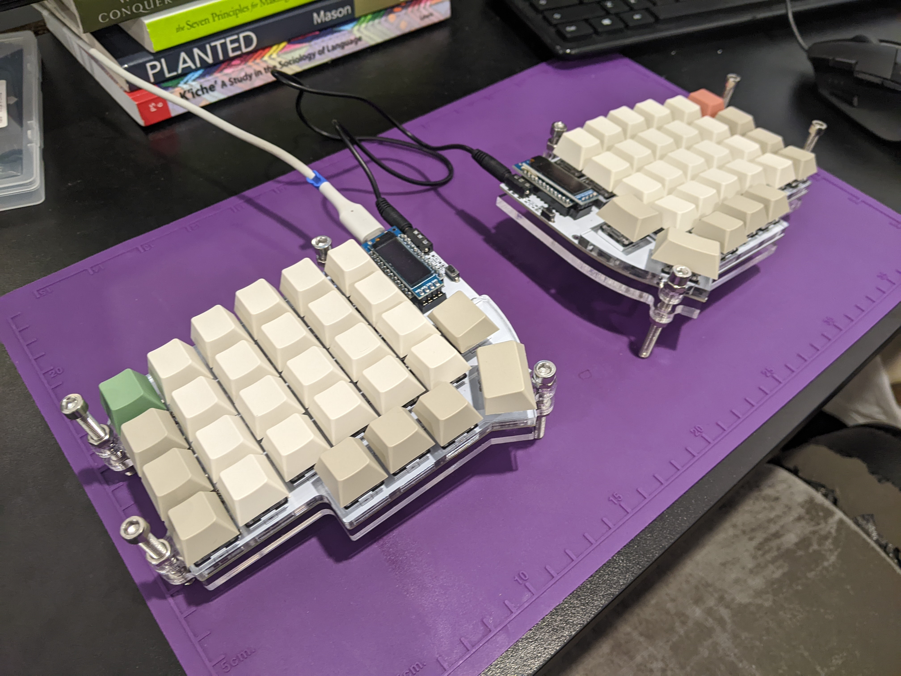

# QMK layout for Lily58

Here's my keyboard:



## usage

This layout is based on the `lily58/rev1` layout available in the QMK repository. If you're a complete noob like me you should check out their [beginner's guide](https://docs.qmk.fm/#/newbs). Once you've set up the QMK dependencies and checked out this repository as your default keyboard and layout, you can easily flash both halves of your keyboard by running the following script and pressing the little black buttons to the side of the OLED screen when instructed.

```sh
./flash.sh
```
